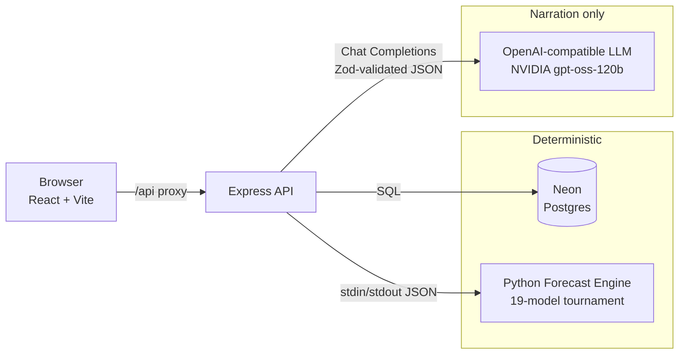
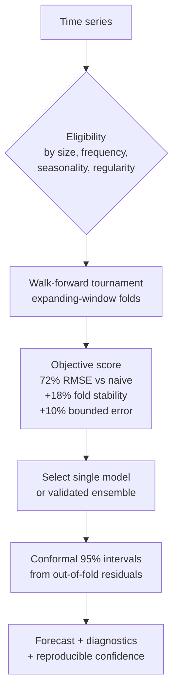
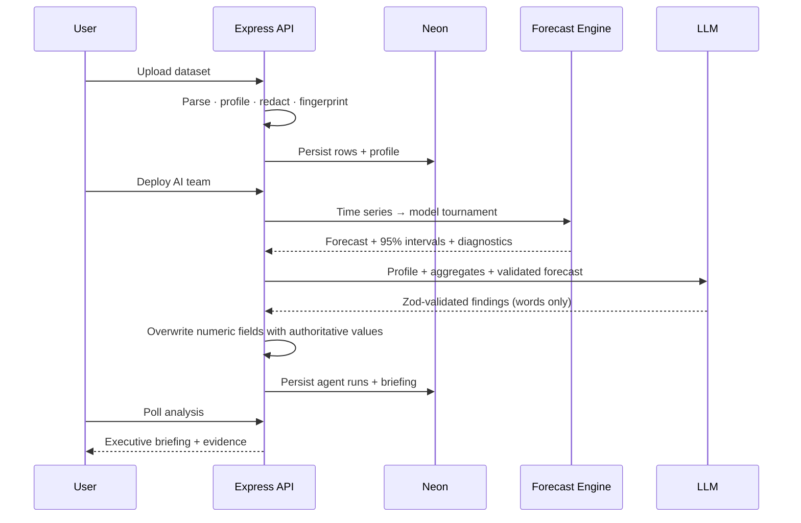

<div align="center">

# 🧭 AI Forecast Studio

**An AI data‑science team for small businesses — from raw data to a defensible decision in minutes.**

Upload a spreadsheet and a team of specialized AI agents prepares your data, forecasts revenue and demand with a real statistical model tournament, quantifies the risk, and recommends what to do next — every number is computed deterministically, and the AI only *explains* it.


</div>

---

## Table of contents

- [Why it's different](#why-its-different)
- [Meet the AI team](#meet-the-ai-team)
- [Feature tour](#feature-tour)
- [Architecture](#architecture)
- [The forecast engine](#the-forecast-engine)
- [Quick start](#quick-start)
- [Configuration](#configuration)
- [Project structure](#project-structure)
- [API reference](#api-reference)
- [Security model](#security-model)
- [Testing & quality](#testing--quality)
- [How a request flows](#how-a-request-flows)

---

## Why it's different

Most "AI analytics" tools let a language model invent the numbers. **This one doesn't.** There is a hard boundary between computation and narration:

| Layer | Responsibility | Who does it |
| --- | --- | --- |
| **Numbers** | Forecasts, prediction intervals, business‑health score, decision scores | Deterministic code — the Python engine + `analytics.ts` |
| **Words** | Explaining *why* the model won, what the risk means, what to do | The LLM, constrained to Zod‑validated JSON |

AI‑generated fields that would normally be hallucinated (forecast direction, confidence, health score) are **overwritten with authoritative values** after generation. If no validated forecast exists, those fields are `null` rather than guessed. The result is an assistant that reads like a team of analysts but is auditable like a spreadsheet.

> The system doesn't just give you an answer — it shows you the team that produced it, and the evidence behind every claim.

---

## Meet the AI team

Each analysis runs a five‑specialist workflow, orchestrated by a team lead who synthesizes the final briefing.

| | Agent | Role | Contribution |
| --- | --- | --- | --- |
| **EL** | **Elena** | Data Engineer | Data readiness, completeness, schema quality, temporal coverage |
| **NO** | **Noah** | Data Scientist | Trends, seasonality, anomalies, segment drivers |
| **MA** | **Maya** | Forecast Specialist | Interprets the model tournament — why the winner won, why others were rejected |
| **OW** | **Owen** | Risk Analyst | Stress‑tests findings, quantifies operational/financial exposure |
| **AV** | **Ava** | Strategy Lead | Turns evidence into one prioritized, measurable action |
| **AT** | **Atlas** | Team Lead | Synthesizes the executive briefing and consensus |

---

## Feature tour

- **📥 Real ingestion** — CSV, XLSX and JSON uploads with deterministic schema inference, data profiling, time‑series aggregation, and sensitive‑column redaction. Exact duplicates are detected by SHA‑256 content fingerprint and reused instead of re‑stored.
- **📊 Deterministic analytics** — period revenue, demand, cost, gross margin, closing inventory, trends and leading segments, computed from the authenticated user's persisted rows in Neon. No demo values are ever substituted for real business metrics.
- **🔮 Forecast Intelligence** — a scientific model tournament (19 candidates) with walk‑forward validation and conformal prediction intervals. See [The forecast engine](#the-forecast-engine).
- **💬 Team Meetings** — ask one specialist or the whole team. Runs as an **asynchronous job**: each specialist response streams in as it completes, Atlas synthesizes at the end, and you can leave the page and come back — answers appear on their own via polling. Jobs support **cancel, retry, and recovery after a restart**, preserving already‑completed specialists.
- **🏛️ Decision Room** — propose a pricing, growth, hiring, capacity or inventory decision. The team evaluates its business case against the validated forecast and its 95% interval, produces a reproducible **decision score**, and shows a **side‑by‑side comparison** of the previous vs. new scenario with per‑metric deltas.
- **🧠 Insights** — an explainable business‑health breakdown with visible component weights and evidence for every finding.
- **📄 Reports & sharing** — export as **Print/Save‑as‑PDF, CSV, Markdown, JSON or PowerPoint**, or generate a read‑only public share link (with a graceful manual‑copy fallback when clipboard access is denied).
- **🔔 Notifications** — a persisted event stream with unread counts and deep links straight to the relevant conversation or analysis.
- **🗂️ Dataset management** — a multi‑source library (combine up to five datasets), rename/archive/delete, re‑map business fields, and a **persistent context selector** so switching workspaces sticks across reloads.
- **🔐 Accounts** — scrypt passwords, HttpOnly revocable sessions, and opaque Bearer API tokens for programmatic access.

---

## Architecture



| Layer | Technology |
| --- | --- |
| **Frontend** | React 19, TypeScript, Vite, React Router, Lucide icons |
| **API** | Express 5, multipart uploads (multer), async analysis & meeting workers, rate limiting |
| **Database** | Neon Postgres via `@neondatabase/serverless`, idempotent SQL migrations |
| **AI** | OpenAI JS SDK against an OpenAI‑compatible endpoint (NVIDIA `gpt-oss-120b` by default), Zod‑validated structured outputs |
| **Forecasting** | Python 3.12 subprocess: NumPy, SciPy, statsmodels, scikit‑learn, Prophet, XGBoost, LightGBM, CatBoost, TensorFlow (all optional at runtime) |

The inference provider only ever receives the dataset **profile**, aggregated **time series**, and a **redacted sample** — never the full source records, which stay in Neon. Reasoning content is never exposed in the product UI.

---

## The forecast engine

`forecast_engine/engine.py` reads one JSON request from stdin and emits one JSON response — a self‑contained, deterministic scientific runtime. Its design is documented and audited in [`forecast_engine/SCIENTIFIC_AUDIT_V2.md`](forecast_engine/SCIENTIFIC_AUDIT_V2.md).



**19 candidate models** across four families:

- **Statistical** — Linear & Multiple Linear Regression, Moving Average, Weighted MA, Exponential Smoothing, Holt, Holt‑Winters, ARIMA, SARIMA, Prophet, Seasonal Decomposition, STL
- **Machine learning** — Random Forest, Gradient Boosting, XGBoost, LightGBM, CatBoost
- **Deep learning** — LSTM, GRU (only unlocked on long, stable histories)

Key scientific controls (all corrections over V1 are in the audit doc):

- **No single‑holdout selection.** Every eligible model competes on identical expanding‑window walk‑forward origins; random splits are prohibited and reported as `randomSplit: false`.
- **Honest eligibility.** A model must clear a size/frequency/seasonality/regularity gate *and* have enough history in the earliest common fold — a 20‑point series will never train an LSTM.
- **Validated ensembles only.** Inverse‑squared‑RMSE blends are accepted solely when they beat the best single model out‑of‑fold by ≥1%.
- **Conformal intervals.** 95% prediction bands come from finite‑sample conformal quantiles of the selected strategy's walk‑forward residuals — not an arbitrary √‑rule.
- **Reproducible confidence.** The confidence score exposes nine named, weighted components, recomputable from forecast error, interval width, completeness, history, fold stability and more.

If the engine is unavailable, the API degrades gracefully to a validated statistical fallback rather than failing the analysis.

---

## Quick start

**Requirements:** Node.js 20+, a [Neon](https://neon.tech) project, an NVIDIA API key (or any OpenAI‑compatible endpoint), and — for the full model tournament — Python 3.12 with [`uv`](https://github.com/astral-sh/uv).

```bash
# 1. Install JS dependencies
npm install

# 2. Configure environment
cp .env.example .env
#   → fill in DATABASE_URL and AI_API_KEY (see Configuration below)

# 3. (Optional but recommended) set up the Python forecast engine
npm run forecast:setup      # creates .venv and installs the scientific stack

# 4. Apply the database schema
npm run db:migrate

# 5. Run everything
npm run dev
```

`npm run dev` starts:

- **Web** → http://localhost:5173 (Vite)
- **API** → http://127.0.0.1:8787 (Express, with a dev proxy from `/api`)

Then create an account, connect a dataset (or use the built‑in **Northstar Retail** sample), deploy your AI team, and open the Command Center when Atlas's briefing is ready.

> Without the Python engine, forecasting automatically uses the validated statistical fallback — the app still runs end‑to‑end.

---

## Configuration

All configuration is via `.env` (see [`.env.example`](.env.example)):

| Variable | Purpose | Default |
| --- | --- | --- |
| `DATABASE_URL` | Neon pooled connection string | — (required) |
| `AI_BASE_URL` | OpenAI‑compatible endpoint | `https://integrate.api.nvidia.com/v1` |
| `AI_API_KEY` | Inference provider key | — (required) |
| `AI_MODEL` | Model id | `openai/gpt-oss-120b` |
| `AI_TIMEOUT_MS` | Per‑call timeout | `300000` |
| `AI_MAX_RETRIES` | Provider retry attempts | `1` |
| `AI_MAX_OUTPUT_TOKENS` | Cap for agent findings | `1200` |
| `AI_BRIEFING_MAX_TOKENS` | Cap for executive briefing | `1600` |
| `AI_REASONING_EFFORT` | `low` \| `medium` \| `high` | `low` |
| `MEETING_JOB_TIMEOUT_MS` | Team‑meeting job budget | `360000` |
| `FORECAST_PYTHON_BIN` | Python interpreter for the engine | `.venv/bin/python` |
| `FORECAST_ENGINE_TIMEOUT_MS` | Engine execution budget | `180000` |
| `API_PORT` | API port | `8787` |
| `APP_ORIGIN` | CSRF/CORS origin allowlist (comma‑separated) | `http://localhost:5173,http://127.0.0.1:5173` |
| `MAX_UPLOAD_MB` | Max upload size | `25` |
| `MAX_DATASET_ROWS` | Max rows per dataset | `50000` |

**Using the native OpenAI API instead of NVIDIA:**

```dotenv
AI_BASE_URL=https://api.openai.com/v1
AI_API_KEY=sk-proj-...
AI_MODEL=gpt-5.4-mini
```

---

## Project structure

```
.
├── src/                      # React frontend
│   ├── App.tsx               # Shell, routing, onboarding & dashboard
│   ├── api.ts                # Typed API client
│   ├── auth.tsx              # Auth context & protected routes
│   ├── scenarioHistory.ts    # Decision Room scenario comparison state
│   ├── components/           # Charts, notifications, search, bookmarks
│   └── pages/                # Forecasts, Insights, Decision Room, Meetings, Reports, Settings…
│
├── server/                   # Express API
│   ├── index.ts              # Routes, middleware, workers bootstrap
│   ├── auth.ts               # scrypt + hashed session/token auth
│   ├── ingestion.ts          # Parse, profile, redact, sample
│   ├── analytics.ts          # Deterministic business metrics & health
│   ├── forecast-intelligence.ts  # Bridge to the Python engine
│   ├── orchestrator.ts       # Multi-agent analysis & meeting workers
│   ├── reliability.ts        # Job recovery / retry logic
│   ├── repositories.ts       # Data access & ownership enforcement
│   ├── errors/               # Centralized error catalog
│   ├── db/migrations/        # 001…005 idempotent SQL migrations
│   └── *.test.ts             # 29 node:test cases
│
└── forecast_engine/          # Python scientific runtime
    ├── engine.py             # 19-model walk-forward tournament
    ├── test_engine.py        # unittest suite
    └── SCIENTIFIC_AUDIT_V2.md # design & audit trail
```

---

## API reference

Every `/api` route except health, registration, login, token issuance and public report views passes through auth middleware. Browsers use the secure HttpOnly cookie; programmatic clients send `Authorization: Bearer <token>`. Mutating requests are restricted to the `APP_ORIGIN` allowlist, and all dataset/analysis queries enforce workspace ownership.

<details>
<summary><b>Auth & session</b></summary>

| Method | Route | Purpose |
| --- | --- | --- |
| `POST` | `/api/auth/register` | Create account + HttpOnly session |
| `POST` | `/api/auth/login` | Authenticate + create session |
| `POST` | `/api/auth/token` | Exchange credentials for a Bearer token (returned once) |
| `POST` | `/api/auth/logout` | Revoke the current cookie or token |
| `GET` | `/api/auth/me` | Current authenticated user |
| `GET` | `/api/health` | Credential & database readiness |
</details>

<details>
<summary><b>Datasets & analytics</b></summary>

| Method | Route | Purpose |
| --- | --- | --- |
| `POST` | `/api/datasets/ingest` | Deduplicated multipart ingestion |
| `POST` | `/api/datasets/sample` | Persisted Northstar demo dataset |
| `GET` | `/api/datasets` | Full dataset history |
| `GET` | `/api/datasets/:id` | Dataset profile |
| `PATCH` | `/api/datasets/:id` | Rename |
| `POST` | `/api/datasets/:id/archive` | Archive |
| `DELETE` | `/api/datasets/:id` | Delete |
| `PATCH` | `/api/datasets/:id/mapping` | Re‑map business fields |
| `GET`/`PUT` | `/api/datasets/:id/note` | Dataset note |
| `POST` | `/api/datasets/recalculate` | Recompute analytics |
| `GET` | `/api/datasets/latest/current[/analytics]` | Latest dataset & aggregates |
| `GET` | `/api/datasets/:id/analytics` | Aggregates for an owned dataset |
</details>

<details>
<summary><b>Analyses & team</b></summary>

| Method | Route | Purpose |
| --- | --- | --- |
| `POST` | `/api/analyses` | Start the AI‑team workflow (1–5 datasets) |
| `GET` | `/api/analyses/:id` | Poll analysis & agent statuses |
| `POST` | `/api/analyses/:id/retry` | Resume a failed analysis from the first incomplete agent |
| `GET` | `/api/analyses/latest/current` | Latest analysis |
| `GET` | `/api/analysis-contexts` | Available business contexts |
| `GET` | `/api/team/conversations[/:id]` | Meeting history / a conversation |
| `POST` | `/api/team/ask` | Ask one specialist or the whole team *(async, 202)* |
| `GET` | `/api/team/jobs/:id` | Poll a meeting job |
| `POST` | `/api/team/jobs/:id/cancel` | Cancel a running meeting |
| `POST` | `/api/team/jobs/:id/retry` | Retry, preserving completed specialists |
</details>

<details>
<summary><b>Decisions, reports, workspace</b></summary>

| Method | Route | Purpose |
| --- | --- | --- |
| `POST` | `/api/decisions` | Record a Decision Room evaluation |
| `POST` | `/api/reports/share` | Create a public share link |
| `GET` | `/api/public/reports/:token` | Read‑only public report *(no auth)* |
| `GET` | `/api/exports/:scope` | Export bundle for a report type |
| `GET` | `/api/executive/overview` | Command Center summary |
| `GET` | `/api/search` | Executive search over evidence |
| `GET`/`PUT` | `/api/preferences` | AI‑team preferences |
| `GET`/`POST`/`DELETE` | `/api/bookmarks[/:id]` | Saved evidence |
| `GET` | `/api/notifications` | Notifications + unread count |
| `PATCH` | `/api/notifications/:id/read` | Mark one read |
| `POST` | `/api/notifications/read-all` | Mark all read |
</details>

**Error contract** — every failure is normalized to a stable, safe shape; provider/DB/stack details stay in server logs keyed by the same request id:

```json
{ "error": { "code": "AUTH_REQUIRED", "message": "Your session has expired. Sign in again to continue.", "requestId": "..." } }
```

---

## Security model

- **Passwords** hashed with `scrypt` and compared in constant time (`timingSafeEqual`).
- **Sessions** are opaque random tokens; only their SHA‑256 hashes are persisted, and logout revokes them. Cookies are `HttpOnly`, `SameSite=Lax`, and `Secure` in production.
- **CSRF** — mutating requests must originate from the `APP_ORIGIN` allowlist.
- **Rate limiting** on auth endpoints.
- **Row ownership** enforced on every dataset and analysis query.
- **Data minimization** — the LLM receives only profiles, aggregates and redacted samples; sensitive columns detected at ingestion are excluded from model samples.
- **Deduplication integrity** — a partial unique index in Neon prevents duplicate uploads within a workspace, even under concurrency.
- **Safe errors** — a centralized catalog guarantees no internal detail leaks to clients.

---

## Testing & quality

```bash
npm run lint            # ESLint
npm run build           # tsc (web + server) and Vite build
npm run test:server     # 29 node:test cases
npm run test:forecast   # Python engine unittest suite (needs .venv)
npm audit --omit=dev    # dependency audit
```

Server tests cover analytics, ingestion, error normalization, formatting, job reliability/recovery, meeting deep‑links, and Decision Room scenario history.

---

## How a request flows



---

<div align="center">

**Built with a simple principle: the machine does the math, the team explains the decision.**

*AI outputs should always be reviewed before material business decisions.*

</div>
